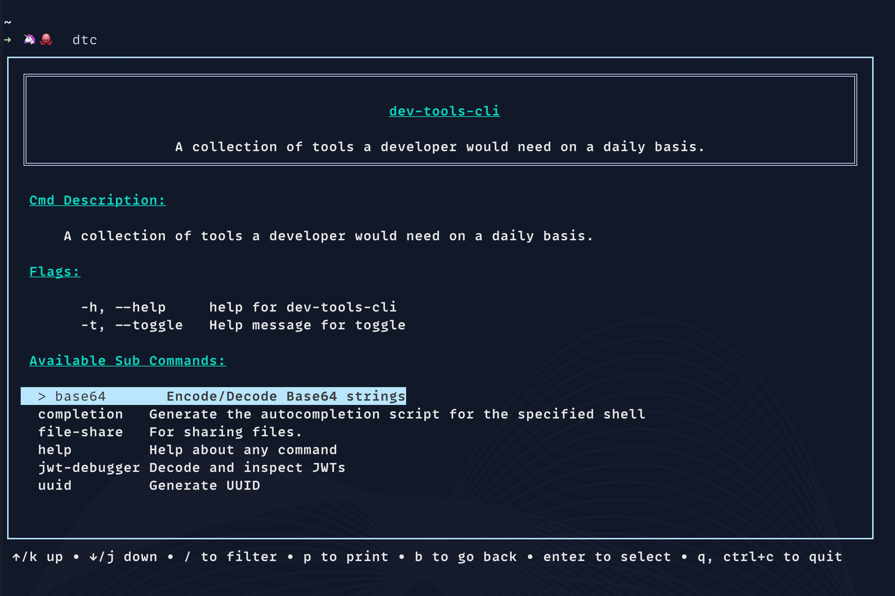

<h1 align="center">Welcome to DevTools CLI 🛠️</h1>
<p>
  
  <a href="https://twitter.com/jimgbest" target="_blank">
    
  </a>
</p>

> A collection of tools that you would normally reach for a browser for.



Written in Go and leaning heavily on Cobra and the suite of tools from [Charm](https://charm.sh/):

- [Bubbletea](https://github.com/charmbracelet/bubbletea)
- [Lipgloss](https://github.com/charmbracelet/bubbletea)
- [Bubbles](https://github.com/charmbracelet/bubbles)

<h1>👷 This project is WIP and will have more added to it in the future.</h1>

## Install

```sh
go install github.com/jim-at-jibba/dtc@latest
```

## Commands

### UUID

> Generate UUID v4

The output of this command is automatically copied to the clipboard 📋

<details>
  <summary>Example</summary>

```bash
dtc uuid generate
```

**Takes count flag to generate mulitple UUIDs at a time**

```bash
dtc uuid generate --count=100
```


</details>

### Base64

The output of this command is automatically copied to the clipboard 📋

#### Encode

> Encode and Decode base64 strings in both standard and URL compatible formats

<details>
  <summary>Example</summary>

**Standard**

```bash
dtc base64 encode
```

**URL Compatible**

```bash
dtc base64 encode -u
```


</details>

#### Decode

> Encode and Decode base64 strings in both standard and URL compatible formats

<details>
  <summary>Example</summary>

**Standard**

```bash
dtc base64 decode
```

**URL Compatible**

```bash
dtc base64 decode -u
```


</details>

### File Share

The output of this command is automatically copied to the clipboard 📋

> Ephemeral file sharing, the link provided will expire, after a given time or when the file is downloaded. Makes use of [https://file.io](https://file.io)

Note that there's a limit of 100mb on files

<details>
  <summary>Example</summary>

**Defaults to 14 days expiry**

```bash
dtc file-share
```

**Pass in an expiry time frame**

```bash
dtc file-share

# current dir, expires in 3 days
dtc file-share --expiry=3d

# expires in 4 weeks
dtc file-share --expiry=4w
```


</details>

### JWT Debugger

> Debug JWT - Validity is not tested!

The output of this command is automatically copied to the clipboard 📋

<details>
  <summary>Example</summary>

```bash
dtc jwt-debugger
```


</details>

### Lorem Ipsum generator

The output of this command is automatically copied to the clipboard 📋

<details>
  <summary>Example</summary>

```bash
dtc lorem-ipsum
```

</details>
## Author

👤 **James Best**

- Website: jamesbest.uk
- Twitter: [@jimgbest](https://twitter.com/jimgbest)
- Github: [@jim-at-jibba](https://github.com/jim-at-jibba)

## Show your support

Give a ⭐️ if this project helped you!
